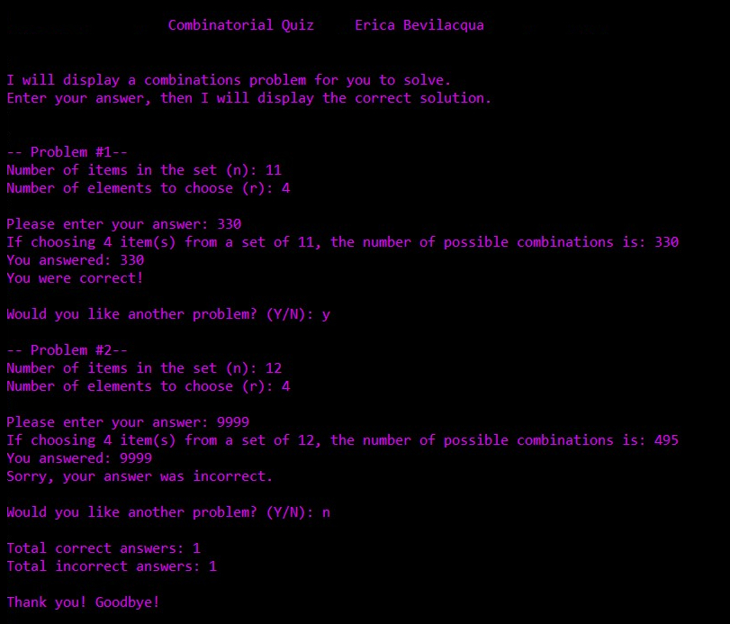

# Combinatorial Quiz
A CLI application that quizzes the user on randomly-generated combination (nCr) problems, written in Assembly Language for MASM (32-bit). The program features input validation, conversion of ASCII input to integer values, and use of the FPU for calculations.

*Please note: As school coursework, this project's content and coding style conform to assignment/instructor specifications.*

### Assembly
This project may be assembled in Visual Studio. For instructions and additional required library/include files (`Irvine.zip`):\
[Getting Started with MASM and Visual Studio 2019](http://www.asmirvine.com/gettingStartedVS2019/index.htm)

### Quiz Play
To run, Debug > Start Without Debugging in Visual Studio.\
The CLI application will provide a randomly-generated combination (nCr) problem.\
Input an answer via keyboard and the program will report the correct solution and provide feedback about the given answer.\
Follow prompts to receive another problem, or to see a final score and exit the program.
